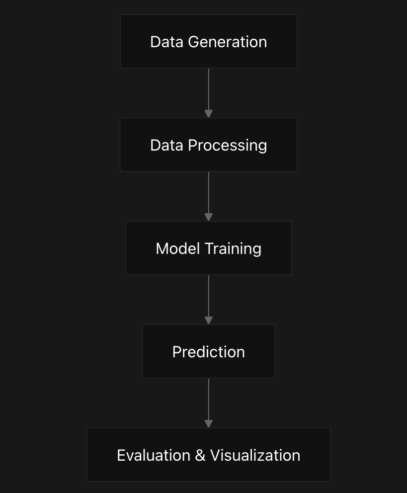
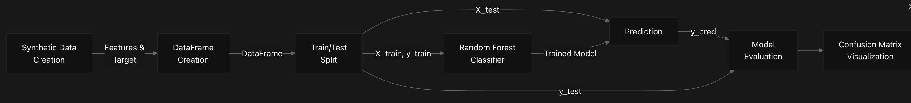
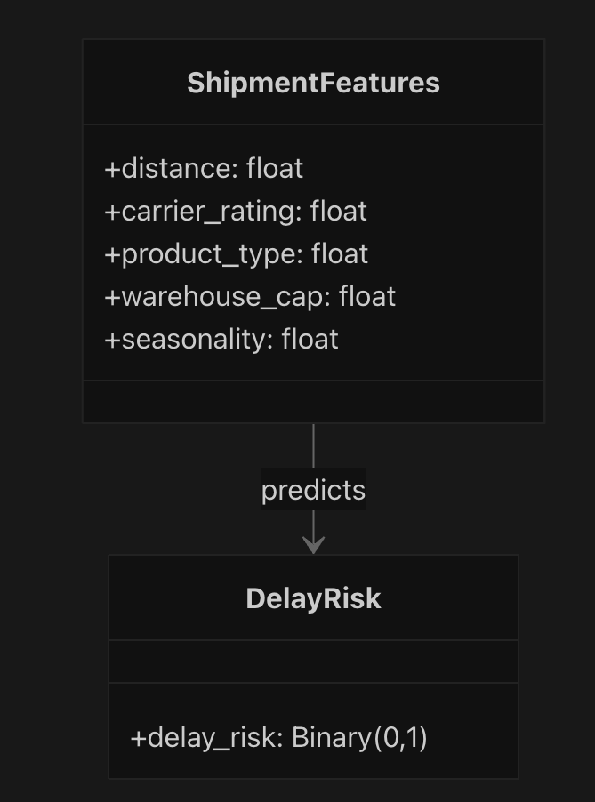
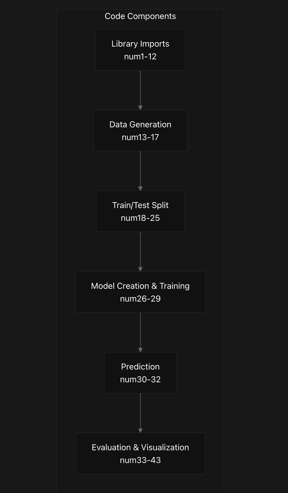
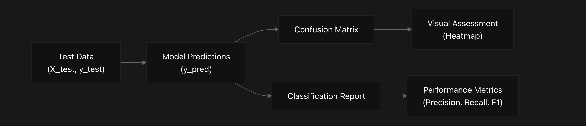
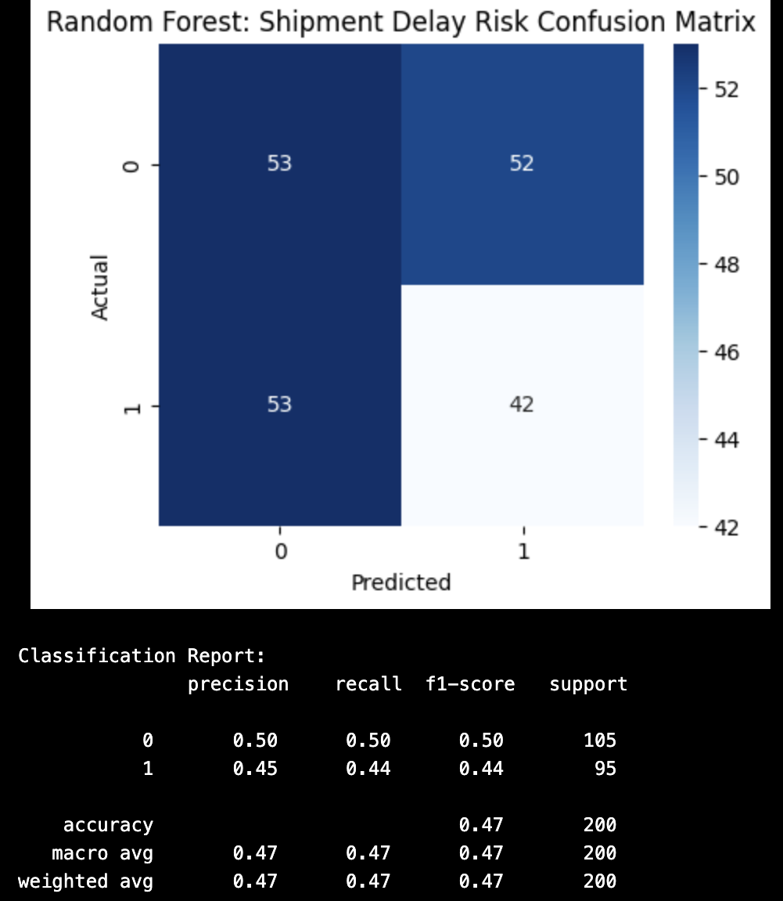

# Random-Forest Overview
This document provides an overview of the Random Forest Classifier for Shipment Delay Risk system. The system is a machine learning application that predicts the likelihood of shipment delays based on various shipping factors. It implements a complete machine learning pipeline from synthetic data generation to model evaluation, using the Random Forest classification algorithm.

## System Purpose and Functionality
The Random Forest Classifier system is designed to classify shipment delay risks into two categories (High or Low) based on five key shipping features. The system demonstrates the application of Random Forest, an ensemble learning method, for solving a binary classification problem in the logistics domain.
 

## Machine Learning Pipeline
The system implements a standard machine learning workflow consisting of the following key stages:

## Features and Target Variable
The system uses synthetic data to simulate real-world shipment information with five key features that influence delay risk:

- distance: Shipping distance (normalized value between 0-1)
- carrier_rating: Rating of the shipping carrier (normalized value between 0-1)
- product_type: Type of product being shipped (normalized value between 0-1)
- warehouse_cap: Warehouse capacity (normalized value between 0-1)
- seasonality: Seasonal factor affecting shipping (normalized value between 0-1)
- delay_risk: Target variable (0 = Low delay risk, 1 = High delay risk)

## Implementation Overview
The system is implemented in a single Jupyter notebook using Python and popular data science libraries. The key components of the implementation are:

Where:
- num1-12: numpy, pandas, sklearn, matplotlib, seaborn imports
- num13-17: Synthetic data generation for features and target
- num18-25: Splitting data into training and testing sets
- num26-29: Creating and training the RandomForestClassifier
- num30-32: Making predictions on test data
- num33-43: Creating confusion matrix and classification report

## Model Configuration
The Random Forest classifier is configured with the following parameters:

Parameter	            Value	               Description
n_estimators	        100	                   Number of decision trees in the forest
max_depth	            5	                   Maximum depth of each decision tree
random_state	        42	                   Seed for random number generation (for reproducibility)

## Evaluation Methods
The model's performance is evaluated using standard classification metrics:

The confusion matrix provides a visual representation of the model's predictions versus actual values, while the classification report provides detailed metrics including precision, recall, and F1-score.

## Repository Structure
The repository has a simple structure with just two main files:

File	                        Purpose
RandomForest.ipynb	            Jupyter notebook containing the entire implementation
README.md	                    Brief documentation of the project

### Code Notebook:

        import numpy as np
        import pandas as pd
        from sklearn.ensemble import RandomForestClassifier
        from sklearn.model_selection import train_test_split
        from sklearn.metrics import confusion_matrix, classification_report
        import matplotlib.pyplot as plt
        import seaborn as sns
        
        # 1. SYNTHETIC DATA CREATION
        X = np.random.rand(1000, 5)  # [distance, carrier_rating, product_type, warehouse_cap, seasonality]
        y = np.random.randint(0, 2, 1000)  # 0 = Low delay risk, 1 = High delay risk
        
        df = pd.DataFrame(X, columns=['distance','carrier_rating','product_type','warehouse_cap','seasonality'])
        df['delay_risk'] = y
        
        # 2. TRAIN/TEST SPLIT
        X_train, X_test, y_train, y_test = train_test_split(
            df.drop('delay_risk', axis=1),
            df['delay_risk'],
            test_size=0.2,
            random_state=42
        )
        
        # 3. MODEL TRAINING
        rf_model = RandomForestClassifier(n_estimators=100, max_depth=5, random_state=42)
        rf_model.fit(X_train, y_train)
        
        # 4. PREDICTION
        y_pred = rf_model.predict(X_test)
        
        # 5. VISUALIZATION: Confusion Matrix
        cm = confusion_matrix(y_test, y_pred)
        plt.figure(figsize=(5, 4))
        sns.heatmap(cm, annot=True, cmap='Blues', fmt='d')
        plt.title("Random Forest: Shipment Delay Risk Confusion Matrix")
        plt.xlabel("Predicted")
        plt.ylabel("Actual")
        plt.show()
        
        print("Classification Report:\n", classification_report(y_test, y_pred))
        

